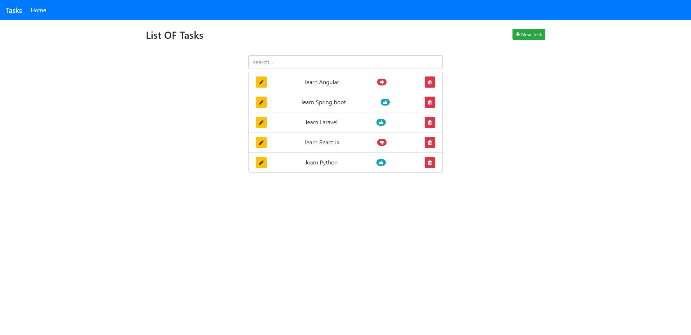

# Angular Crash Course 2022 (Tasks Manager App)

This is the project from the [YouTube crash course](https://youtu.be/i0jHgkoro1A "Angular de A a Z avec une Api Rest et Json Server en Darija
"). It includes the Angular ui as well as JSON-server for our mock backend

##Screen



## Usage

### Install dependencies

```
npm install
```

### Run Angular server (http://localhost:4200)

```
ng serve
```

### Run the JSON server (http://localhost:5000)

```
npm run server
```

### To build for production

```
ng build
```